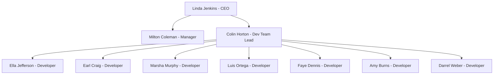
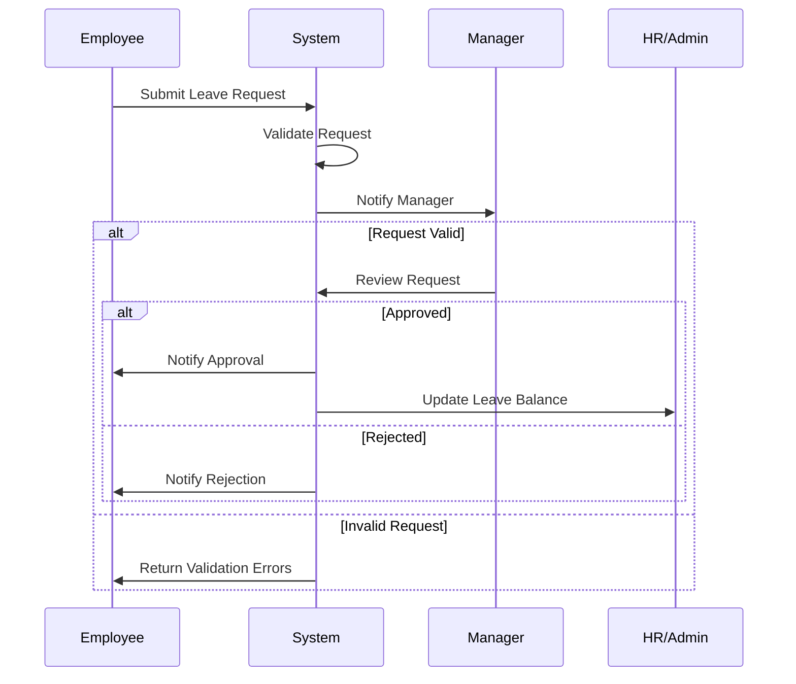
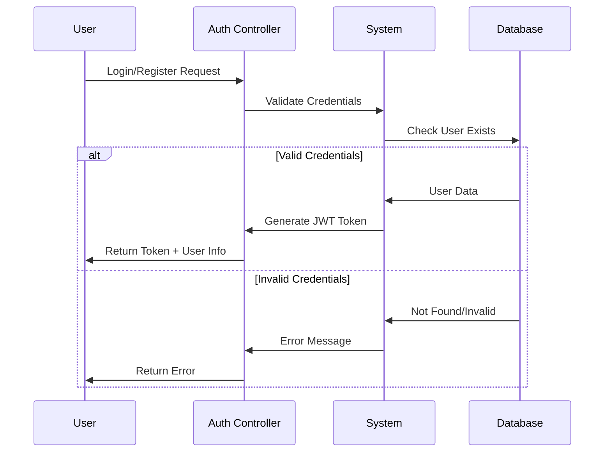

# Leave Management System

A comprehensive leave management system built with ASP.NET Core that handles employee leave requests, approvals, and management.

## System Flow Diagrams










## Features

1. **User Management**
   - Role-based access control (Admin, Manager, Employee)
   - User hierarchy management
   - Authentication using JWT tokens

2. **Leave Management**
   - Submit leave requests
   - Approve/Reject requests
   - Leave balance tracking
   - Multiple leave types support

3. **Public Holiday Management**
   - Automatic holiday recognition
   - Holiday calendar management
   - Regional holiday support


## Technical Stack

- **Backend**: ASP.NET Core 9.0
- **Database**: SQL Server
- **Authentication**: JWT Bearer
- **Validation**: FluentValidation
- **Logging**: Serilog

## Getting Started

1. Ensure you have .NET 9.0 SDK installed
2. Clone the repository
3. Update the connection string in `appsettings.json`
4. Run database migrations:
   ```bash
   dotnet ef database update
   ```
5. Run the application:
   ```bash
   dotnet run
   ```

## API Endpoints

### Authentication
- POST `/api/Auth/register` - Register new user
- POST `/api/Auth/login` - User login

### Leave Requests
- GET `/api/Leaves` - Get all leaves
- POST `/api/Leaves` - Create leave request
- PUT `/api/Leaves/{id}` - Update leave request
- DELETE `/api/Leaves/{id}` - Delete leave request

### Public Holidays
- GET `/api/PublicHolidays` - Get all public holidays
- POST `/api/PublicHolidays` - Add public holiday
- PUT `/api/PublicHolidays/{id}` - Update public holiday
- DELETE `/api/PublicHolidays/{id}` - Delete public holiday